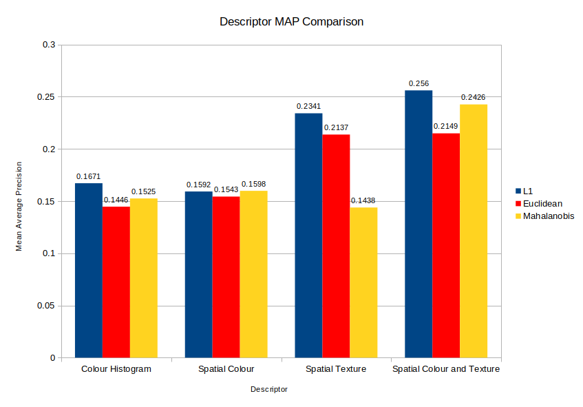
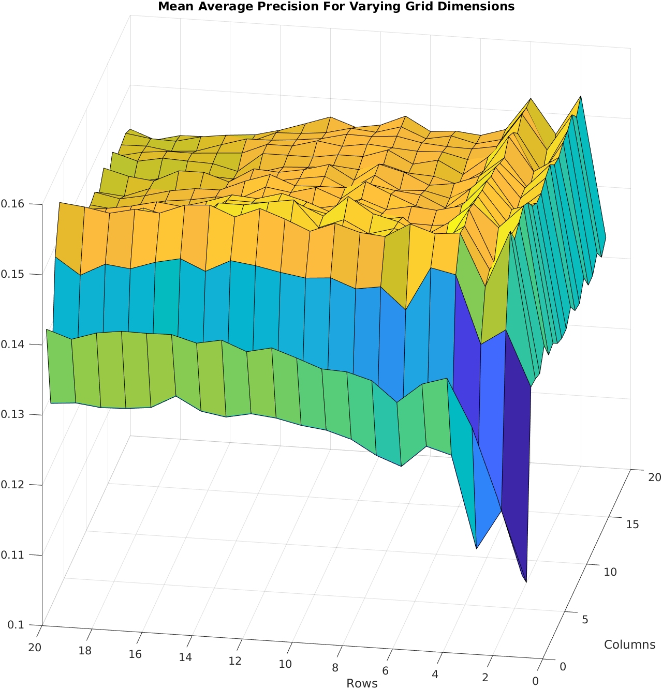
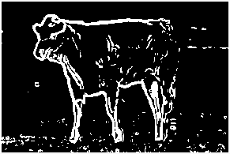

Visual Search Coursework
=======================

Investigation into different methods of visual search including colour histograms, spatial colour, spatial texture and a combination of the two using MATLAB and the MSRCv2 dataset.
A copy of the report can be seen [here](report.pdf). Submitted as part of the third year EE3032 Computer Vision & Pattern Recognition module, this piece achieved full marks.

## Code

/data - pulled images and spreadsheet of data
/descriptor - functions for extracting descriptors
/distance - functions for measuring distance between descriptors
/util - util functions such as toGreyscale and EVD

There are two types of script, ones that run a category response once (cvpr_visualsearch_*) and ones that iteratively 
generate new descriptors to run queries on (parameter_*)

_query_set operates using either L1 or L2 norm on the query set
_pca generates an eigenmodel from the descriptors and computes mahalanobis distance
_rand_image picks a random query image from each category to iterate over, no results from this script are in the paper

The cvpr_visualsearch_* scripts load descriptors from folders and perform a category response test on them.

The parameter_* scripts were used to generate iterative parameter results for descriptors.
Effectively the query code from the cvpr_visualsearch_* files have been prefaced with descriptor generators that as a whole
iterate over parameters instead of loading them from files.
